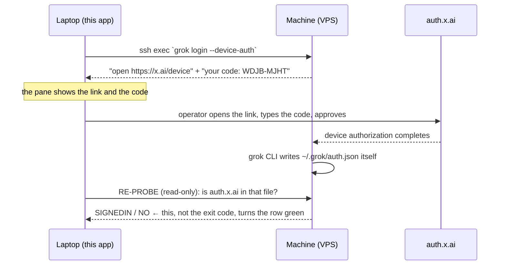
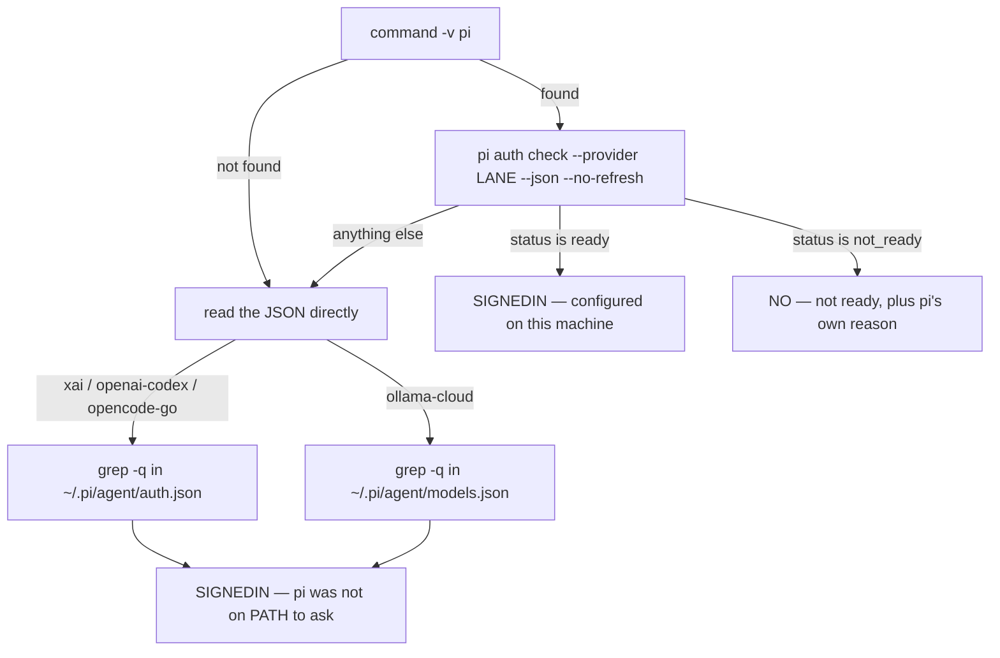
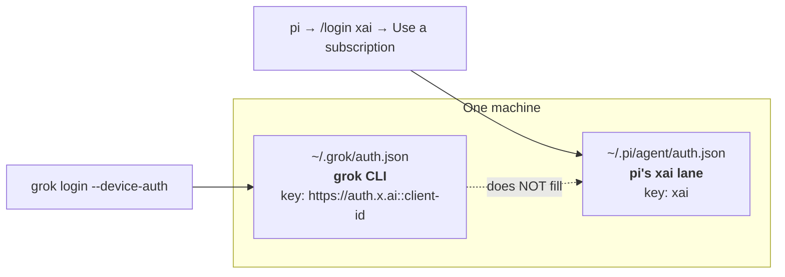
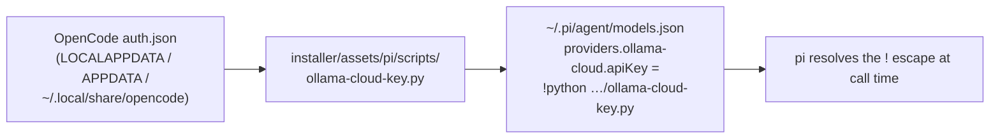

# Provider Auth Map — Grok First, and What Each Lane's Login Actually Is

**Researched:** 2026-08-17, for the morning of 2026-08-18. **Method:** the binaries themselves, on the
operator's own laptop, read-only. `grok --help` / `grok login --help` from `C:/Users/Mubarak/.grok/bin`, the
shape (keys only, never a value) of the real `~/.grok/auth.json` and `~/.pi/agent/auth.json`, `pi --help` and
`pi auth --help`, pi's own shipped documentation at
`%APPDATA%/npm/node_modules/@earendil-works/pi-coding-agent/docs/`, and `installer/steps.py`'s `AUTH_LANES`.
Every preset block was executed through a real `pi` in a sandbox. **Nothing was signed in, refreshed, minted or
written during this pass** — see §6 for exactly what was avoided and why.

---

## Verdict, in one screen

| Lane | Is it a key? | The command that signs it in | Where the credential lands | Can this app run it over SSH? |
|---|---|---|---|---|
| **Grok / xAI (grok CLI)** | **No — OAuth/OIDC** | **`grok login --device-auth`** | machine's `~/.grok/auth.json` | **YES — and it is now wired** |
| Claude | No — OAuth | `claude setup-token` | machine's `~/.sdl-factory/secrets.env` | yes (already wired) |
| Codex | No — OAuth | `codex login` | machine's `~/.codex/auth.json` | yes (already wired, port 1455) |
| pi lane `xai` | No — OAuth subscription | `/login xai` **inside pi's TUI** | machine's `~/.pi/agent/auth.json` | **no — check-only, proven below** |
| pi lane `openai-codex` | No — OAuth | `/login openai-codex` **inside pi's TUI** | machine's `~/.pi/agent/auth.json` | no — check-only |
| `opencode-go` | Yes — API key | browser sign-in at `opencode.ai/auth` | OpenCode's `auth.json`, or pi's | no — no command mints a key |
| `ollama-cloud` | Yes — API key | `opencode auth login` → ollama-cloud | read by `ollama-cloud-key.py` | no — no command mints a key |

**The headline for tomorrow: Grok is not key-based, and you do not need to fall back to `XAI_API_KEY`.** xAI
ships a device-code login built for exactly this situation, and the app now drives it.

**The trap to know before you start:** signing into the grok CLI does **not** sign in pi's `xai` lane. They are
two different files on the same box. §3 is about that.

---

## 1. Grok / xAI — grounded, and it is a real CLI login

### 1.1 The command, from the binary's own help

```
$ grok login --help
Sign in to Grok

Usage: grok login [OPTIONS]

Options:
      --oauth        Use Grok OAuth via auth.x.ai
      --device-auth  Use device-code authentication for headless/remote
                     environments [aliases: --device-code]
```

Two flows, and the choice between them is the whole design decision:

| | `--oauth` | `--device-auth` ✅ |
|---|---|---|
| How it completes | browser redirect back to a **local callback** | operator types a **code** on any device |
| Needs a browser on the machine | effectively yes | **no** |
| Needs a forwarded port | **yes** (the `codex` problem) | **no** |
| Right for a headless VPS over SSH | no | **yes — xAI says so in the help text** |

`--device-auth` is chosen. That is why the `grok` row in `AUTH_FLOWS` has `callback_port: null` — not an
oversight, the point of the flag.

### 1.2 What the login writes, read off the operator's real file

`~/.grok/auth.json` is a map with **one key**, the OIDC issuer joined to the client id:

```
"https://auth.x.ai::b1a00492-073a-47ea-816f-4c329264a828": {
    "auth_mode":       "oidc",
    "key":             <JWT access token>        ← redacted, never read by this app
    "refresh_token":   <opaque>                  ← redacted, never read by this app
    "expires_at":      "2026-08-15T22:02:36Z",
    "oidc_issuer":     "https://auth.x.ai",
    "oidc_client_id":  "b1a00492-…",
    "user_id" / "email" / "team_id" / …
}
```

So `auth_mode: "oidc"` settles it: **OAuth, not an API key.** The probe therefore greps for the literal
`auth.x.ai` and answers with an exit code — it never prints a byte of that file.



Nothing crosses the wire from the laptop, and nothing is harvested: unlike `claude setup-token`, the grok CLI
saves its own credential, so the flow's `capture` is `null` and the app writes no file on the machine at all.

### 1.3 `installer/steps.py` still says the old thing, and that is fine

`AUTH_LANES["xai"]` reads `'launch pi, then /login xai, choose "Use a subscription"'`. That line is **still
correct** — but it is about **pi's** xai lane, not the grok CLI's. The two are different lanes with different
stores, and the installer only ever knew about the first. `installer/` was not modified in this pass.

---

## 2. pi's login — the open question, now closed: TUI-only

The `auth-sessions.ts` header carried an explicit debt: *"ONE LIVE CONFIRMATION IS OWED HERE — whether the
operator's pi build exposes a non-TUI login."* Asked. **The answer is no.**

**Proof 1 — the whole auth surface, from the binary:**

```
$ pi auth --help
Usage:
  pi auth print-api-key      [--provider <p>] [--model <m>]
  pi auth print-bearer-token [--provider <p>] [--model <m>] [--min-expiry <d>]
  pi auth check              [--provider <p>] [--model <m>] [--json] [--credentials] [--no-refresh]
```

Three subcommands. **There is no `pi auth login`.**

**Proof 2 — pi's own shipped `docs/providers.md`, verbatim:**

> "Use `/login` in interactive mode, then select a provider"

> "**xAI (Grok/X subscription)** — Run `/login xai`, then select **Use a subscription**. `XAI_API_KEY` remains
> available through **Use an API key**"

So the 409 stays, but it is no longer an apology. It now returns the operator's next action:

> `pi lane: xai is check-only in this app. The grok CLI's sign-in and pi's xai lane are two different stores…
> run `pi` on the machine, type `/login xai`, and choose "Use a subscription". This row only checks.`

### 2.1 What that same help DID hand over: a real non-TUI probe

This is the upgrade. Every pi lane used to be checked by grepping JSON for a quoted provider name. pi answers
the question itself, machine-readably:

```
$ pi auth check --provider xai --json --no-refresh
{"status":"ready","provider":"xai","authType":"oauth"}

$ pi auth check --provider anthropic --json --no-refresh
{"status":"not_ready","provider":"anthropic","reason":"credentials_not_configured"}

$ pi auth check --provider nosuchprovider --json --no-refresh
{"status":"not_ready","provider":"nosuchprovider","reason":"provider_not_found"}
```

Exit code is `0` on ready and `1` otherwise — but the probes parse the **JSON**, not the code, so a future pi
that changes its exit convention cannot silently flip a row.

**Three rules govern its use here, and two of them are safety rules:**

1. **`--no-refresh` is mandatory.** Without it the command *"refresh[es] expired OAuth credentials by
   default"* — that is a **write**, from something this codebase calls a read-only probe. Every generated
   probe carries the flag, and a test asserts it on every lane.
2. **`--credentials` is never passed.** It is the flag that *"emits the credential"*. A test asserts its
   absence on every lane.
3. **`ready` means *configured*, not *valid*.** ⚠️ See §2.2.

### 2.2 ⚠️ `ready` on an expired token — measured, and it resolves an old contradiction

`providers-v3.ts`'s header records a prior, unexplained observation: `pi auth check` *"reported ready on an
expired token and not_ready on a working one in the same session."* Half of that reproduced exactly:

| | value |
|---|---|
| `~/.pi/agent/auth.json` → `xai.expires` | `1786367550244` = **2026-08-10T13:12:30Z** |
| Wall clock when asked | **2026-08-17T20:14:47Z** — seven days later |
| `pi auth check --provider xai --json --no-refresh` | `{"status":"ready",…}` |

So with `--no-refresh`, **`ready` means "a credential is configured for this lane"**, and nothing stronger. It
is not a lie — pi refreshes the token itself on first use — but a row that printed "working" from it would be
over-claiming. Hence every probe's sentence says the word **configured**:

> `pi auth check says the xai lane is configured on this machine - pi refreshes the token itself on first use`

The other half of the old note ("not_ready on a working one") did **not** reproduce in this pass and is left
recorded rather than declared resolved.

### 2.3 Machines without pi still get an answer

Each lane's probe is two-branched, so a box that has never had pi installed is never met with silence:



The fallback's sentence **says which source answered**. "pi says ready" and "a key is in a file" are different
claims, and a row that blurred them would be lying by omission.

`ollama-cloud` branches to `models.json` on purpose: that lane has **no `auth.json` entry at all** (§5.2), so a
probe that looked there would report "not signed in" about a lane that works.

**Verified against a real POSIX shell.** All seven probe scripts were extracted from `AUTH_FLOWS`, passed
`sh -n`, and then executed under `sh` against a sandbox `HOME` — once with a stub `pi` on `PATH`, once without.
Both branches produced correct `SIGNEDIN`/`NO` lines for every lane. The stub `pi` was written to **exit
non-zero if a probe ever omitted `--no-refresh` or ever passed `--credentials`**; no probe tripped it.

---

## 3. ⚠️ The grok CLI and pi's `xai` lane are two different sign-ins

The single most expensive misunderstanding available tomorrow morning.



Read directly off the operator's real machine — the top-level keys of `~/.pi/agent/auth.json` are
`["openai-codex", "opencode-go", "xai"]`, with `xai` carrying its **own** `{access, refresh, expires, type:
"oauth"}`. That is a separate token set from the one in `~/.grok/auth.json`. **pi does not read the grok CLI's
credentials.**

Practical consequence, and it is now written into the UI row and the manual-proof checklist:

- Driving the **grok CLI** as the workhorse → `grok login --device-auth` is enough. **The app does this.**
- Driving **pi with `--provider xai`** → also run `pi` on the box, `/login xai`, "Use a subscription".

The `pi-xai` row checks the second and says exactly that; the `grok` row's probe deliberately never looks in
`.pi/` (a test asserts it).

---

## 4. Functional preset verification — all nine registered with a real pi

The ask was to *prove* the nine preset blocks register, not argue it.

### 4.1 First: does pi honour a redirected home on Windows?

**Yes — via `USERPROFILE`, not `HOME`.** Measured all three ways:

| Environment | `pi auth check --provider xai` |
|---|---|
| `HOME=<sandbox>` only | `{"status":"ready"}` ← **still reading the real profile** |
| `USERPROFILE=<sandbox>` only | `{"status":"not_ready","reason":"credentials_not_configured"}` ✅ redirected |
| both set | `not_ready` ✅ redirected |

Any future sandbox test on Windows must set **`USERPROFILE`**. Setting only `HOME` silently reads the
operator's real credentials — which is exactly the accident this discipline exists to prevent.

### 4.2 The run

All nine blocks were rendered by importing the **real** `PRESETS` and `providerBlock` from `providers-v3.ts`
(not retyped), written into a sandbox `models.json`, and:

```
USERPROFILE=<sandbox> PI_OFFLINE=1 pi -ne -ns -np --offline --list-models
```

**Result:**

- **9 / 9 providers registered** — `deepseek, fireworks-ai, groq, mistral, ollama-cloud, opencode-go,
  openrouter, togetherai, zai`. Zero missing, zero extra.
- **Every preset model id listed**, including the awkward ones: `accounts/fireworks/routers/kimi-k2p7-code-fast`,
  `deepcogito/cogito-v2-1-671b`, `MiniMaxAI/MiniMax-M2.7`, `deepseek/deepseek-v4-flash`, `glm-4.7`.
- **stderr was empty** — 0 bytes.

That last point is the load-bearing one, because pi is loud about a bad block.

### 4.3 The negative control — the check discriminates

Deliberately broken blocks through the identical path. pi refused each **by name** and dropped the provider:

| Broken block | pi's own words |
|---|---|
| invalid JSON | `Warning: errors loading models.json:` / `Failed to parse models.json: Unexpected end of JSON input` |
| no `api` | `Provider "noapi": … no "api" specified. Set at provider or model level.` |
| no `baseUrl` | `Provider "nourl": … "baseUrl" is required when defining custom models.` |

Each then printed `No models available.` So "empty stderr, all nine listed" is a real signal, not a vacuous
one. **These three rejection modes are now a regression test** in `providers-v3.test.ts` — *"no preset can
produce a block in a shape pi was measured rejecting"*.

### 4.4 ⚠️ What this does NOT prove — stated because the gap is real

pi **accepted** a block whose `api` was the nonsense string `not-a-real-api` and listed its model happily. So
`--list-models` validates **shape**, not transport, and no endpoint was called in any of this.

| Proven | Not proven |
|---|---|
| pi parses all nine blocks | that any base URL answers |
| all nine providers register under their own ids | that any key is valid |
| every preset model id is selectable | that `api: "openai-completions"` is right *per vendor* |
| pi loudly rejects malformed blocks; ours are not | anything about live cost, limits or rate |

Only a real call proves the right column. That is a morning-of check, not a test.

### 4.5 One documented caveat found while reading pi's docs

pi's own `docs/custom-provider.md` carries a migration note:

> "Migration note: Mistral moved from `openai-completions` to `mistral-conversations`. If you intentionally
> route Mistral-compatible/custom endpoints through `openai-completions`, set `compat` flags explicitly as
> needed."

The `mistral` preset uses `openai-completions`, and pi **accepted** it (registered, listed all model ids). So
the block was **not** changed blind — a working shape is not broken on the strength of a doc note. The caveat
is now written into that preset's `source_note`: if Mistral calls misbehave, `api` is the first thing to try.

### 4.6 On adding an `xai` preset — deliberately not done

pi's docs note `XAI_API_KEY` "remains available through **Use an API key**", so a key-based xai preset is
*possible*. It was not added, because the operator's stated intent is **CLI auth, not API key** for the
workhorse lane, and a key-shaped xai row in the catalog would invite exactly the wrong path on the one lane
where it matters most. The OAuth path is fully wired instead. Flagged here so the decision is visible and
reversible — it is one entry in `PRESETS` if that intent ever changes.

---

## 5. The two key-mint lanes — each row now names its real path

Neither can be minted by a command on any machine. Both rows say so, and say what to do instead.

### 5.1 `opencode-go`

Key comes from a **browser sign-in at `https://opencode.ai/auth`**, or `opencode auth login` → `opencode-go`,
which writes OpenCode's own `auth.json`. Confirmed present on this laptop as
`{"opencode-go": {"key": …, "type": "api_key"}}` in `~/.pi/agent/auth.json`, and `pi auth check --provider
opencode-go` answers `{"status":"ready","authType":"api_key"}`.

### 5.2 `ollama-cloud` — the lane whose key is not in `auth.json`

`installer/steps.py` wires this one differently from every other provider, and the difference matters for the
probe:



There is **no `ollama-cloud` entry in `auth.json`** — the key is fetched by script at call time. Hence the
probe's fallback reads `models.json`, and `pi auth check --provider ollama-cloud` (which resolves the `!`
escape) answered `{"status":"ready","authType":"api_key"}` on this laptop — confirming the script path works
end to end.

### 5.3 On wiring the key script into sync

**Not done, deliberately.** The task allowed it *"if steps.py's pattern makes that automatic and safe."* It
does not, for one concrete reason: `sync-ollama-cloud-models.py`'s own `--from-server` path reads connection
details out of `~/.pi/qmx-babysitter/qmx-bmad-watcher.py` and reaches a VPS. That is a second, undocumented
machine-addressing mechanism living beside `machines.ts`'s registry, and quietly running it on sync would mean
this app initiating a network call to a host the operator never picked in the UI. The honest wiring — the row
naming the script and the check proving pi can resolve its key — is what shipped. `installer/` was not touched.

---

## 6. What this pass refused to do

Recorded because a research pass that touches live credentials should say where it stopped.

- **No `pi auth check` without `--no-refresh`, ever.** It would have refreshed the operator's real xAI and
  Codex tokens — a write to `~/.pi`.
- **No refresh test in a sandbox either.** Copying the real `auth.json` into a sandbox and refreshing there
  would still hit xAI's servers with the operator's real refresh token, and a rotated refresh token can
  invalidate the live one. On the night before he ships, that risk buys nothing.
- **No `--credentials`, no `print-api-key`, no `print-bearer-token`.** Never run once in this pass.
- **No login, logout, or `grok login` executed.** `--help` only.
- **No secret value read or printed.** Every inspection of a real auth file printed key names and non-secret
  scalars (`auth_mode`, `expires`, `oidc_issuer`); token fields were redacted at the point of reading.
- **`adws/` and `installer/` unmodified.**

---

## 7. Tomorrow morning, in order

1. **Settings → Providers → pick the machine.**
2. **Grok row → "Sign in on \<machine\>".** A link and a short code come back. Open the link here, type the
   code, approve. No port forward involved.
   Verify on the box: `ls -l ~/.grok/auth.json` and `grep -c auth.x.ai ~/.grok/auth.json` — do **not** `cat` it.
3. **`pi lane: xai` row → "Check on \<machine\>".** It will say *not signed in*, and **that is correct** — the
   two stores are separate. To fill it: on the box run `pi`, type `/login xai`, choose "Use a subscription",
   quit, Check again.
4. Claude and Codex rows as before (Codex still forwards 127.0.0.1:1455 while it runs).
5. `opencode-go` / `ollama-cloud` rows → Check. If red, the key is minted in a browser, not by a command —
   each row's own sentence says where.

---

## 8. Where this landed in code

| File | What changed |
|---|---|
| `apps/ui/server/app/auth-sessions.ts` | `grok` flow (`grok login --device-auth`, device-code, no forward); `pi-xai`, `opencode-go`, `ollama-cloud` check-only flows; every pi lane's probe upgraded to `pi auth check --json --no-refresh` with a two-branch fallback; `pi-codex`'s original JSON probe **kept** as that fallback; 409 now returns the exact TUI line; `extractCode` widened for a labelled bare device code; header's open question closed with the proof |
| `apps/ui/server/app/auth-sessions.test.ts` | fake box models "does this box have pi" and the grok store; end-to-end Grok device login (code + link + no forward + re-probe decides), an unfinished login ending red, a readable pairing code; pi-lane checks with and without pi; the two-stores assertion; `--no-refresh` present / `--credentials` absent asserted per lane; manual-proof checklist now starts with Grok |
| `apps/ui/server/app/providers-v3.ts` | preset-verification transcript in the header (incl. the `USERPROFILE`-not-`HOME` seam and the honest "does not prove"); `opencode-go` and `ollama-cloud` `source_note`s name their real mint paths; `mistral` records pi's migration caveat |
| `apps/ui/server/app/providers-v3.test.ts` | regression test for the three block shapes pi was **measured** rejecting |
| `apps/ui-v3/src/settings/Providers.tsx` | Grok row first, drawn from the flow table; the single hardcoded pi-codex row generalized to all four pi lanes, each printing its "type this" sentence on the row rather than hiding it in a tooltip |

**Gates:** `apps/ui-v3` `bunx tsc --noEmit` ✅ · `bunx vite build` ✅ · `apps/ui` `bunx tsc -p tsconfig.server.json` ✅ ·
`bun test` **240 pass / 0 fail** ✅
