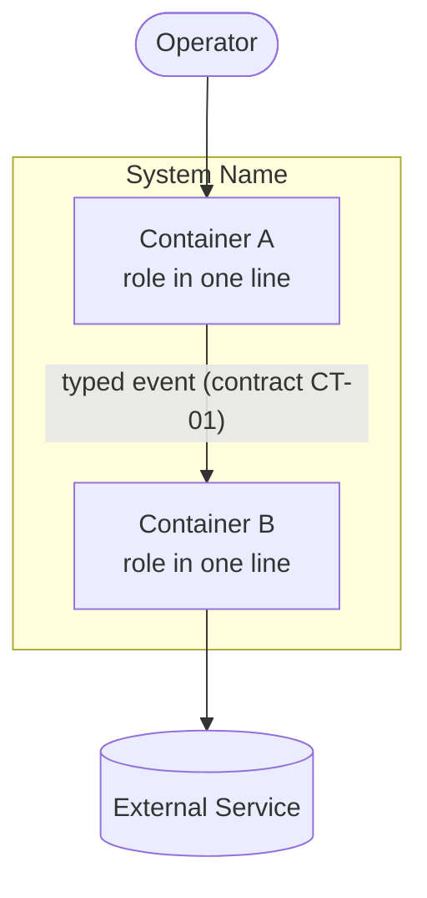
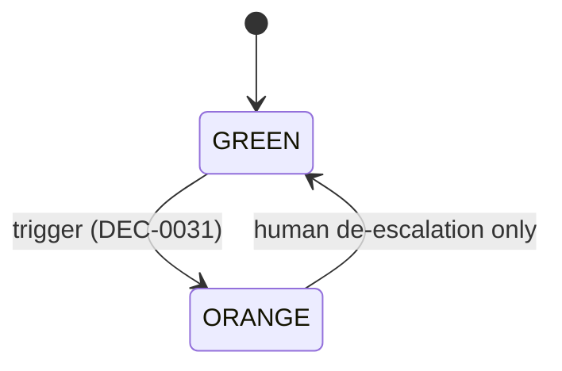
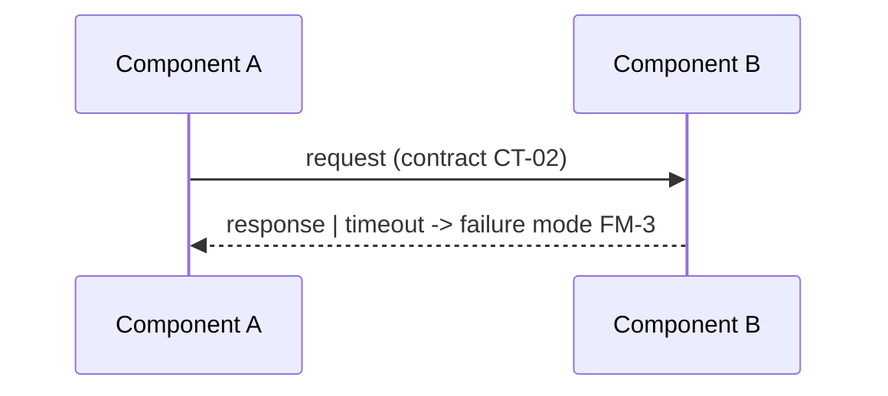

# Diagram Conventions

Diagrams exist to let a stranger (human or agent) form the right mental model in under a minute. Standard: **C4 model**, rendered as **Mermaid in fenced code blocks** — portable across GitHub, GitBook (via Git sync), and local markdown viewers, and readable as plain text by agents.

## Which docs require which diagram

- `architecture/overview.md` — **Level 1 (System Context)**: the system as one box, its users/operators, and every external system it touches. Plus **Level 2 (Container)**: the major runtime pieces and their communication. Plus the **layer view** — one lane per active layer, answering "what is UI, middleware, backend and data at a glance"; the pattern lives with the taxonomy it draws, in `references/layer-conventions.md`.
- `components/<name>.md` — **Level 3 (Component)** *when* the component has internal structure worth a diagram (more than ~3 internal parts or a non-obvious flow). Simple components may skip it; lint accepts a `<!-- no-diagram: reason -->` marker instead.
- Sequence diagrams — wherever a multi-party interaction's *order* matters (startup handshakes, failure cascades, event flows). Optional but strongly encouraged for anything a red-team reviewer had to trace by hand.
- State diagrams — mandatory for any component whose spec describes a state machine. If the spec lists states, the diagram shows every state and every legal transition; the diagram and the enum in the contract must match exactly.

What `lint_docs.py` actually checks: `architecture/overview.md` carries at least one Mermaid block, and every component spec carries one or a `<!-- no-diagram: reason -->` marker. That the overview's blocks are the Level 1, the Level 2 *and* the layer view is read by a human — Stage 7's consistency reviewer — because no script can tell those three apart.

## Mermaid patterns

Level 1/2 (C4 via flowchart — portable subset, avoid experimental C4 syntax):

State machine:

Sequence:

## Rules

1. Every edge label that represents data names its contract ID where one exists.
2. Node names match component IDs/glossary names exactly — a diagram introducing a new name is a lint-worthy bug.
3. Annotate transitions with their governing decision (`DEC-…`) when the transition is a law.
4. One diagram, one question. If a diagram answers "what talks to what" *and* "what order" *and* "what states", split it.
5. Keep diagrams under ~15 nodes; beyond that, add a level of hierarchy instead.
