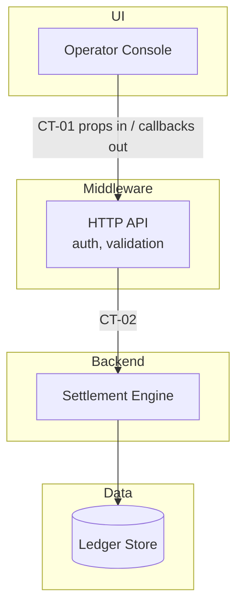

# Layer Conventions

Where the line between UI, middleware, backend and data is drawn — and the rule that it is always drawn. A component whose layer nobody declared is a component two agents will implement in two places; a source that describes a screen *and* its query in one breath becomes one blurred component unless something splits it. This file is that something.

Read at Stage 5 (contracts), enforced there by `validate_registry.py`, and re-read at Stage 6 whenever a component spec covers more than one layer.

## The four layers (plus external)

| Layer | Owns | Never |
|---|---|---|
| `ui` | Rendering and capturing human interaction. Takes data in, sends intent out. | Reaches a store, a third party, or a business rule directly. |
| `middleware` | The seam: routing, request/response shaping, authn/authz, validation, rate limiting, adapters to external systems. | Owns a business rule. If it decides something the constitution cares about, it is backend. |
| `backend` | Business rules, domain logic, orchestration — the decisions the ledger ratified. | Renders. Knows a screen exists. |
| `data` | Stores and their schemas: persistence, migration, retention, access patterns. | Holds a business rule. A rule living in a trigger or a view is a backend rule filed in the wrong layer. |
| `external` | Anything the project neither owns nor deploys. | Is described as if the project could change it. |

The `kind` field says *what a component is* (`service | library | middleware | store | ui | external | process`); the `layer` field says *where it sits*. They are not the same axis: a `library` can be `ui` or `backend`, and a `service` can be `middleware` or `backend`.

## Rules

1. **Every component declares its layer.** `docs/architecture/dependencies.yaml`, one `layer:` per component, from the vocabulary above. `validate_registry.py` errors on a missing or off-vocabulary value — Stage 5 is where this is cheap, and the whole point of drawing the line before prose exists.
2. **Every contract names its seam.** A contract in `docs/contracts/` records `layer_from` and `layer_to` — which layer produces the payload and which consumes it. A contract joining two components in the *same* layer says so too; that is a legitimate seam, just an internal one.
3. **Split mixed inputs along the seam.** A transcript, screen, or design packet that describes an interface *and* the query behind it is describing two components. Record two, put a contract between them, and let the contract carry every field the source mentioned. Never one component "that also does" the other half.
4. **Dependencies run downward.** `ui → middleware → backend → data`, or sideways into `external`. An upward edge (a backend component that `depends_on` a UI component) is a line-drawing defect: the shared thing is a contract, not a dependency. `validate_registry.py` errors on every upward edge at Stage 5 — the layers are already in hand there, so the direction is a comparison, not a judgement. Same-layer and skip-a-layer edges are downward and pass; edges touching `external` are exempt.
5. **The layer travels to the tickets.** A feature in the inventory that touches components in three layers is `multi-pass` unless the operator says otherwise — the split downstream falls on these lines, so drawing them badly here is paid for at ticket-writing time.

## The UI contract shape

Where the seam is `ui → middleware` (or `ui → backend`), the contract takes a fixed shape, so that a UI can be built, reviewed, and swapped against it without a running system:

- **Data in.** Every value the interface renders, named and typed, as inbound fields. The UI never fetches; it receives.
- **Callbacks out.** Every intent the interface can raise, named as an event with its payload — `onSubmit(orderId, quantity)`, not "the button saves the order".
- **States.** Empty, loading, error, and the populated case, each with the data shape that produces it.
- **Sample data.** One concrete instance of the inbound shape, with real values, that a reviewer can paste in.

Nothing else crosses. If the UI needs a value the contract does not carry, that is a contract change (and a gap), never a direct read.

## The layer view

A layer view answers one question the C4 levels do not: *what sits where, at a glance*. Draw it in `docs/architecture/overview.md` alongside the Level 1 and Level 2 diagrams (see `diagram-conventions.md`), one lane per active layer, empty lanes omitted:

Every edge label names its contract ID, exactly as everywhere else. Every node name matches a component ID in `dependencies.yaml`.
